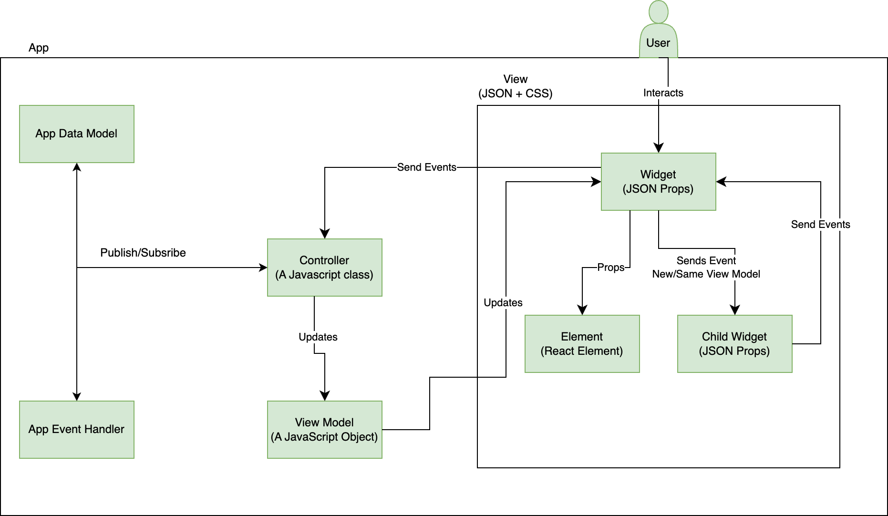

# Jui Framework

Before going into how to write extensions we'll understand the arcitecture of the framework.
So that we may extend it effectively.

## Introduction

JUI is a MVC framework on top of React and Adobe React Spectrum components. JUI is JSON User Interface. It consists of multiple git repositories.

JUI-Core is the core library with all logic to convert JSON config to working react components and link it with a relevant controller class instance.
JUI-React-Spectrum  library has wrapper widgets of Adobe React Spectrum components
## JUI Core Design
### MVC UI Design

### Widget
  - Has a unique ID.
  - Has an individual JSON file for view.
  - Can have an own or shared Controller.
  - Can use parent model or new model.
  - Can have UI elements(React Components)
  - Can have other widgets
  - App is a Widgets

### Element
  - Is an HTML/React Component.
  - Does not have any model, its uses parent widget model.
### Event Handler
  - Next(eventOpts)
    - To trigger event with some opts
  - Subscribe(callback)
    - Get notification that event is fired with configuration
### App/Global Model
  - Next(new value)
    - To publish new value
  - Subscribe(callback)
    - To get notification for value changed
    - First time get old value
  - GetValue()
    - To get current value
### Controller
  - It should be extended from Controller class
  - APIs
  - CreateModel
    - To create child widget separate model
  - InitEventHandler
    - To create child widget separate event handler
  - RegisterCommands
    - To Register local, parent or app events
  - Next(eventName, eventHandler)
    - To trigger event of child widget event handler, parent widget event handler or app event handler
  - Subscribe(callback, eventHandler)
  - SubscribeAppModel(callback)
### Sample App design
