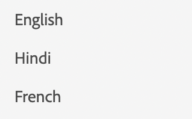

# List

To display a list, we use the component list.

```js title="list.js"

const listJSON =  {
    "component": "list", //tells the component name
    "data": "@languages", // an array of list items
},

```
Here, language is a simple array of strings. `languages = ["English", "Hindi", "French"]`
In case we want to render a list of objects, we can specify the structure using item config.

```js title="list.js"

const listJSON =  {
    "component": "list", //tells the component name
    "data": "@projects", // an array of list items
    "itemConfig": { // used to define the structure of the list items.
    "component": "widget",
    "id": "checkbox_label"
    }
},

```

Usually itemConfig is a `widget`. To learn more about widgets go to [Widgets](../Widgets/basic_widget.md)

The rendered list will look like this:

