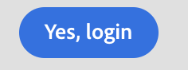

# Button

To display a button we use the component, button.
 The button component in JUI represents an html `<button/>`.

```js title="buttonJSON.js"
const buttonJSON = {
  "component": "button",//tells the component name
  "label": "Yes, login",//tells the text for the button
  "variant": "cta",//tells the variants for the button which  provides default styles
  "on-click": "done",//tells what function to run after user clicks the button
};

```
This will produce a button with a label of `Yes, login`. The other properties includes but are not limited to variant,label,on-click.
> **_NOTE:_**  The `on-<events>` is the syntax for invoking the commands in the controllers.

The rendered button will look like this:


