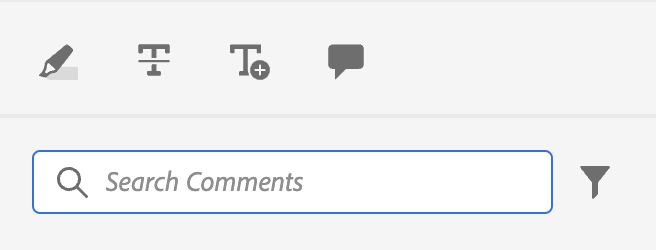
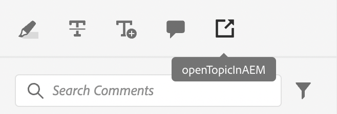

# Simple customisation example

Let us now how to integrate these customisations in our AEM Guides app.

Say, we want to add this button in an exisiting view of the app.
For this we need to 3 basic things:
1. The `id` of the view JSON we want to add our component to.
2. The `target`, i.e. the location in the JSON we want to add the new component to. The `target` is defined using a `key` and `value`. The key-value pair can be any attribute used to define the component that can help in unique identification of it.
We can also use indexes to reference the target.
We have 3 viewStates:  `APPEND`, `PREPEND`, `REPLACE`.
3. The JSON of the newly created component and corresponding methods.

Say we want to add a button to the annotation toolbox used in review, that opens the file in AEM.

```typescript
export default {
  id: 'annotation_toolbox', 
  view: {
    items: [
      {
        component: 'button',
        icon: 'linkOut',
        title: 'Open topic in Assets view',
        'on-click': 'openTopicInAEM',
        target: {
          key: 'value',
          value: 'addcomment',
          viewState: VIEW_STATE.APPEND

        },
      },
    ],
  },
  controller: {
    openTopicInAEM: function (args) {
        const topicIndex = tcx.model.getValue(tcx.model.KEYS.REVIEW_CURR_TOPIC)
        const {allTopics = {}} = tcx.model.getValue(tcx.model.KEYS.REVIEW_DATA) || {}
        tcx.appGet('util').openInAEM(allTopics[topicIndex])
    },
  },
}
```

In the above example we have:
1. the `id` of the JSON we want to insert our component into, i.e. `annotation_toolbox`
2. the target is the `addcomment` button. We add our button after the `addcomment` button using the viewState `append`.
3. We define the on-click event of the button in the controller.

The JSON for the [`annotation_toolbox`](./../../../jsons/review_app/annotation_toolbox.json)

Before customisation, the annotation toolbox looked like this:



After the customisation, the annotation toolbox looks like this:



## Adding CSS

For the consistency we provide the component already styled. The inserted JSON will have inherent styles applied to it
The primary way to manage css is through the extraClass key in the extensions. 
```js
{    
    "view":{
        items:[
            {
                compoenent:"button",
                extraClass:"underline bg-red",
            }
        ]
    }
}

```
You can put custom styles with CSS classes by adding a css file to [clientlibs](#clientlibs). During the build we also create [Tailwind](https://tailwindcss.com/docs/utility-first) output for the utility classes in tailwind. The config for the same can be found at [tailwind.config.js](../../../tailwind.config.js)
