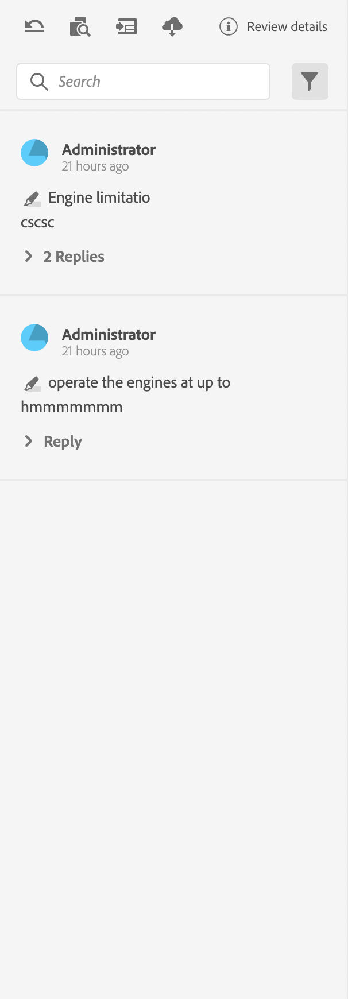
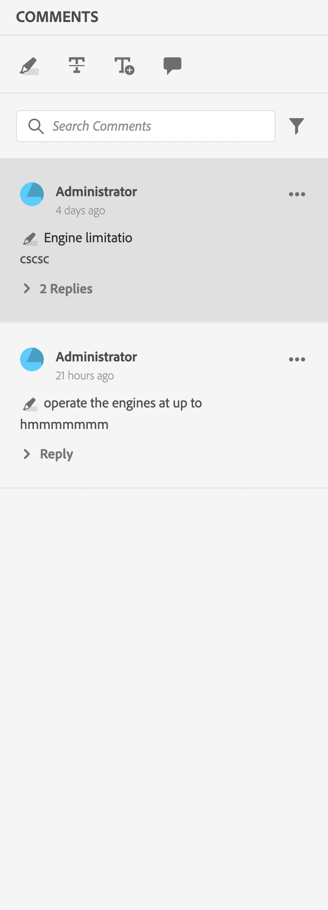
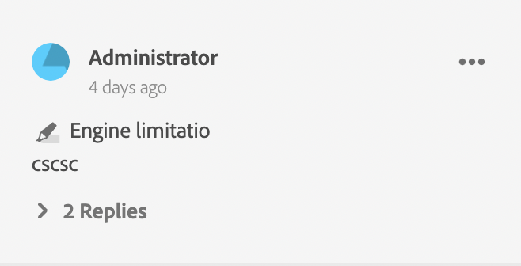
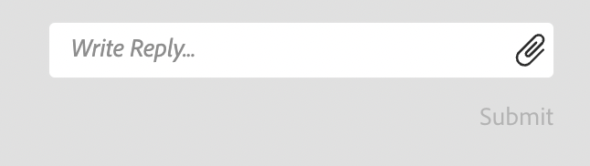

# Review App

### Components of the Review App

Following are the major components of the review app:
- Inline Review Panel: `id: inline_review_panel`
    - The right panel where the review comments are rendered on the XML Editor side.

 

- Topic Reviews: `id: topic_reviews`
    - The right panel where the comments are rendered on the Review App.

- Review Comment: `id: review_comment`
    - The widget for each review comment.

- Review Comment Reply: `id: comment_reply`
    - The widget for each review comment reply.

- New Review Comment Reply: `id: comment_new_reply`
    - The widget for new review comment reply.

- Annotation Toolbox: `id: annotation_toolbox`
    - The top right toolbar on the review app.
    
    

To ease the customisation of the review apps, we have 

